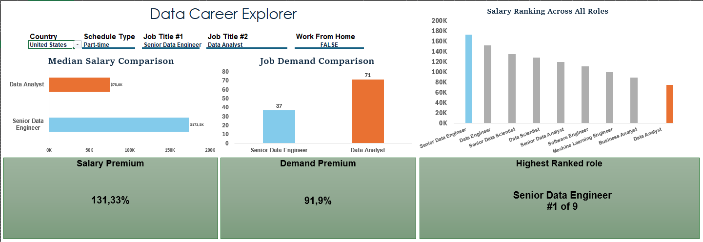
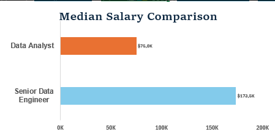
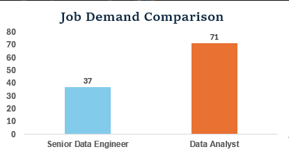
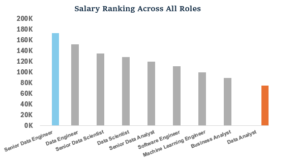
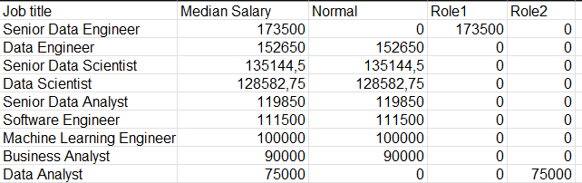

# Data Career Explorer

## Overview

The **Data Career Explorer** is an interactive Excel dashboard for comparing two data-related careers under the same market conditions. Users can change the country, schedule type, two job titles, and work-from-home status to compare salary, job demand, and market position.

> **Core question:** How do two selected data careers compare in salary, demand, and salary rank under identical filters?

## Interactive Dashboard Demo

An 9-second walkthrough of the dashboard: switching the country, schedule type, both compared roles, and work-from-home filter, and watching the KPI cards, comparison charts, and ranking chart update together.


<!--
  Video file: dashboard-demo.mp4 (1280x720, ~18s)
  To embed it: open this README on GitHub in the web editor and drag
  dashboard-demo.mp4 into the text area. GitHub uploads it and replaces
  this comment with a hosted link (starts with
  https://github.com/user-attachments/assets/...) that renders as a
  playable video automatically. Paste that link in place of this comment.
-->


## Dashboard Preview



## Workbook

- [`1_Salary_Dashboard.xlsx`](1_Salary_Dashboard.xlsx)

## Business Questions

1. Which selected role has the higher median annual salary?
2. Which role has greater demand under the active filters?
3. How large is the salary premium between the roles?
4. How large is the demand premium between the roles?
5. Which selected role has the stronger salary rank?
6. How do country, schedule type, and work-from-home status change the comparison?

## Dataset

The Excel workbook contains **32,672 job-posting records** in the `Data` sheet, excluding the header. This count describes this Excel dashboard workbook, not a later Power BI model or an expanded job-skills table.

The dataset includes:

- Job titles and standardized job-title categories
- Locations and countries
- Schedule types
- Work-from-home status
- Annual and hourly salaries
- Company names and posting platforms
- Requested job skills

The dataset and learning inspiration came from Luke Barousse's Excel Data Analytics course.

## Excel Skills Used

- Excel Tables and structured references
- Data Validation dropdowns
- Named ranges
- Dynamic arrays and spilled ranges
- `MEDIAN`, `IF`, `COUNT`, `COUNTIFS`, `MATCH`, `MIN`, `MAX`, `FILTER`, `SORT`, `CHOOSECOLS`, `SEARCH`, and `ISNUMBER`
- Dynamic chart-source tables
- Helper series for conditional chart highlighting
- Custom KPI cards and number formats
- Chart formatting and dashboard layout

## Interactive Filters

The dashboard includes five controls:

- **Country**
- **Schedule Type**
- **Job Title #1**
- **Job Title #2**
- **Work From Home**

The named selections `Country`, `Workplace`, `Role1`, `Role2`, and `Work_From_Home` feed the calculations and chart-source tables.

## Filtered Median Salary


```excel
=MEDIAN(
    IF(
        (jobs[job_country]=Country)*
        (jobs[salary_year_avg]<>0)*
        (jobs[job_title_short]=Role1)*
        ISNUMBER(SEARCH(Workplace;jobs[job_schedule_type]))*
        (jobs[job_work_from_home]=Work_From_Home);
        jobs[salary_year_avg]
    )
)
```

The formula keeps records that satisfy every active filter, excludes zero annual salaries, and calculates the median from the remaining salary values. A parallel formula uses `Role2`.

## Why `SEARCH()` Was Necessary

The schedule field can contain combined descriptions:

```text
Full-time
Full-time and Part-time
Full-time, Part-time, and Internship
```

An exact comparison would incorrectly reject combined descriptions:

```excel
jobs[job_schedule_type]=Workplace
```

The dashboard uses partial matching instead:

```excel
ISNUMBER(SEARCH(Workplace;jobs[job_schedule_type]))
```

`SEARCH()` returns the position of the selected text when it occurs anywhere in the schedule description. `ISNUMBER()` converts the result into the Boolean condition required by the array calculation.

## Filtered Job Demand


```excel
=COUNT(
    IF(
        (jobs[job_country]=Country)*
        (jobs[salary_year_avg]<>0)*
        (jobs[job_title_short]=Role2)*
        ISNUMBER(SEARCH(Workplace;jobs[job_schedule_type]))*
        (jobs[job_work_from_home]=Work_From_Home);
        jobs[salary_year_avg]
    )
)
```

The resulting count represents records that satisfy all active filters and contain a valid annual salary. It is not the unfiltered number of postings in the entire dataset.

## Dynamic Two-Role Chart Sources


The salary and demand comparison charts use compact helper tables linked to `Role1` and `Role2`. This avoids hard-coded category names.

```text
Role dropdowns
      ↓
Two-role helper tables
      ↓
Salary and demand charts
```

These sources are intentionally separate from the all-role ranking source, allowing the ranking logic to change without breaking the first two charts.

## KPI Cards

### Salary Premium


```excel
=(MAX(median_1;median_2)-MIN(median_1;median_2))/MIN(median_1;median_2)
```

Salary Premium shows how much higher the larger median salary is relative to the smaller median salary.

For example:

```text
($173,500 - $75,000) / $75,000 = 131.33%
```

### Demand Premium

```excel
=(MAX(Job_1;Job_2)-MIN(Job_1;Job_2))/MIN(Job_1;Job_2)
```

Demand Premium applies the same logic to the two filtered job counts.

### Highest-Ranked Selected Role


```excel
=IF(
    MATCH(Role1;$AP$2:$AP$11;0)<MATCH(Role2;$AP$2:$AP$11;0);
    Role1;
    Role2
)
```

The role with the smaller position number in the salary-ranked list is returned as the better-ranked selected role.


```excel
="#"&MIN(
    MATCH(Role1;$AP$2:$AP$11;0);
    MATCH(Role2;$AP$2:$AP$11;0)
)&" of "&COUNT($AQ$2:$AQ$11)
```

Using `COUNT($AQ$2:$AQ$11)` makes the denominator dynamic. When one role has no valid salary, `#1 of 10` automatically becomes `#1 of 9`.

## Dashboard Visualizations

### Median Salary Comparison



A horizontal bar chart compares Role 1 and Role 2 median salaries. The horizontal layout accommodates longer role names and supports direct salary comparison.

### Job Demand Comparison



A clustered column chart compares the number of matching records for the selected roles.

### Salary Ranking Across All Roles



The ranking chart compares all roles with valid median salaries under the selected country, schedule, and work-from-home filters. The selected roles remain prominent while the other roles provide market context.

## Case Study: Building a Truly Dynamic Ranking Chart

The most challenging part of the project was making the ranking chart automatically **remove a job title when no valid median salary existed** and **bring that title back when another filter combination produced a valid salary**.

### The original problem

The role-level salary calculation returned an invalid result when no matching salaries existed. Replacing the error with `#N/A` stopped Excel from drawing the bar, but the job-title label could remain on the category axis.

The result could look like this:

```text
10 job-title labels
9 visible salary bars
```

A fixed chart range always included all ten job titles, even when one title had no valid salary.

### Why `NA()` was not the complete solution

`NA()` hides a plotted value, but it does not remove the row from the chart's source range. Therefore, the category itself may remain present.

Returning `0` would also be misleading because it would imply a valid zero-dollar salary rather than missing data.

### The spilled-range difficulty

A spilled range such as:

```excel
AO2#
```

was considered as a dynamic chart source. However, the chart-series reference did not accept or maintain the spilled reference reliably in the required setup.

The original source table also could not be freely restructured because the Median Salary Comparison and Job Demand Comparison charts already depended on it.

### The separate dynamic helper-table solution

A new chart-specific helper table was created:

```excel
=SORT(
    FILTER(
        CHOOSECOLS(T15:Z24;1;4;5;6;7);
        ISNUMBER(W15:W24)
    );
    2;
    -1
)
```

The formula performs three connected tasks:

1. **`CHOOSECOLS()`** selects the job title, median salary, and highlighting series needed by the chart.
2. **`FILTER()`** removes the entire row when the median salary is not numeric.
3. **`SORT()`** ranks the remaining roles from highest to lowest median salary.

Because `FILTER()` removes the source row itself, both the bar and category label disappear. When the filters later produce a valid salary, the role automatically returns to the helper table and chart.

```text
Valid median salary
        ↓
Role included by FILTER()
        ↓
Bar and axis label appear

Invalid median salary
        ↓
Role removed by FILTER()
        ↓
Bar and axis label disappear
```

This solution produces a genuinely dynamic chart whose number of categories expands and contracts with the filtered data.

## Ranking Formula and Output


The sorted result becomes the chart's clean input:



The latest example contains nine valid roles, with Senior Data Engineer assigned to the Role 1 series and Data Analyst assigned to Role 2.

## Dynamic Role Highlighting

The ranking chart uses three helper series:

- **Normal** for unselected roles
- **Role1** for the first selected role
- **Role2** for the second selected role

```excel
=IF(OR($C2=Role1;$C2=Role2);0;$V2)
```

```excel
=IF($C2=Role1;$V2;0)
```

```excel
=IF($C2=Role2;$V2;0)
```

The Normal series is formatted in gray, Role 1 in blue, and Role 2 in orange. Changing either role moves the matching salary into the appropriate colored series automatically.

Highlighting is separate from ranking. Role selections determine emphasis, while the ranking still includes every role with a valid salary.

## Separate Visual Pipelines

The dashboard uses three independent chart pipelines:

```text
Role1 and Role2
→ filtered median helper table
→ Median Salary Comparison
```

```text
Role1 and Role2
→ filtered count helper table
→ Job Demand Comparison
```

```text
All job titles
→ role-level median calculations
→ CHOOSECOLS + FILTER + SORT
→ Salary Ranking Across All Roles
```

This design protected the two working comparison charts while allowing the ranking chart to gain more advanced dynamic behavior.

## Challenges and Solutions

### `#N/A` removed the bar but not the category

The final ranking source uses `ISNUMBER()` and `FILTER()` to remove the entire invalid row before the chart reads it.

### Fixed chart ranges always included ten titles

The dedicated filtered helper table dynamically contracts or expands based on valid median results.

### Direct spill references were unreliable in the chart configuration

A visible helper table provided a predictable, chart-friendly source while retaining dynamic array behavior.

### Schedule descriptions required partial matching

`SEARCH()` and `ISNUMBER()` retain combined schedule descriptions containing the selected schedule type.

### A new ranking table risked breaking existing charts

The ranking source was kept separate from the two-role salary and demand source tables.

### One chart series could not highlight both selections independently

Normal, Role1, and Role2 helper series allowed gray, blue, and orange formatting to update dynamically.

### An early rank formula returned row position instead of salary rank

The final KPI reads from the same sorted titles in column `AP` that power the ranking chart.

### Raw KPI cards duplicated chart values

The final cards report salary premium, demand premium, and the best-ranked selected role, providing interpretation rather than repetition.

## Key Insights from the Displayed Example

With United States, Part-time, Senior Data Engineer, Data Analyst, and non-remote work selected:

- Senior Data Engineer has a median annual salary of approximately **$173.5K**.
- Data Analyst has a median annual salary of approximately **$75.0K**.
- Senior Data Engineer has **37** matching records, while Data Analyst has **71**.
- The salary premium is approximately **131.33%**.
- The demand premium is approximately **91.9%**.
- Senior Data Engineer ranks **#1 of 9** roles with valid median salaries.
- The higher-paying role is not necessarily the role with more matching job records.

These findings change dynamically with the dashboard filters.

## What I Learned

This project strengthened my ability to:

- Translate a career question into dashboard requirements
- Build multi-condition array calculations
- Use named ranges to connect controls, calculations, and visuals
- Create contains-based matching with `SEARCH()`
- Build dynamic chart sources that automatically add or remove categories
- Distinguish missing values from true zero values
- Design independent helper tables for different visual purposes
- Use helper series for conditional chart highlighting
- Keep chart rankings and KPI rankings synchronized
- Debug `#NUM!`, `#N/A`, and `#SPILL!` behavior
- Improve chart readability through labels, axes, colors, and layout
- Turn a tutorial dataset into an original two-career comparison tool

## Conclusion

The **Data Career Explorer** transforms a job-posting dataset into an interactive comparison tool for evaluating two data careers by compensation, demand, and market position.

The most important technical achievement was not simply drawing the charts. It was building a dynamic ranking source that removes invalid categories completely, restores categories when valid results return, preserves two existing comparison charts, and keeps role highlighting and rank KPIs synchronized.

## Acknowledgment

Dataset and learning inspiration: Luke Barousse's Excel Data Analytics course.
